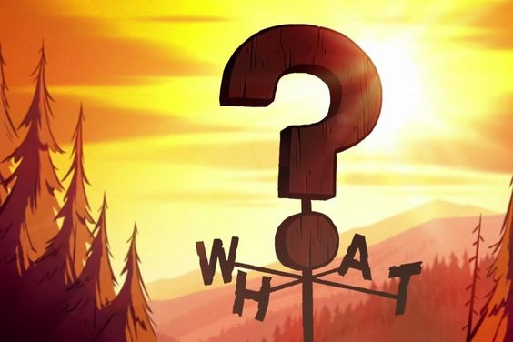

<h1 align="center">Site sobre Gravity Falls</h1>

 O site sobre Gravity Falls é um trabalho de faculdade que fiz para homenagear a série. 

  <a href="#-tecnologias">Tecnologias</a>&nbsp;&nbsp;&nbsp;|&nbsp;&nbsp;&nbsp;
  <a href="#-projeto">Projeto</a>&nbsp;&nbsp;&nbsp;|&nbsp;&nbsp;&nbsp;
  <a href="#memo-licença">Licença</a>

  

 

  

## 🚀 Tecnologias

Esse projeto foi desenvolvido com as seguintes tecnologias:

- HTML e CSS
- PHP
- Git e Github

## 💻 Projeto

Site desenvolvido por mim para um trabalho da faculdade (tema livre) onde deveria ter apenas 3 páginas. Deveriamos apenas usar o HTML, CSS e PHP para desenvolver o site. A primeira página deveria conter HTML e CSS, a segunda deveria ser um formulário em PHP que imprimise na tela o que foi preenchido e a 3 e ultima pagina deveria ser um exercício de vetor resolvido.

## :memo: Licença

Esse projeto está sob a licença MIT.

---

Feito com ♥ by Kamille &Delta;
